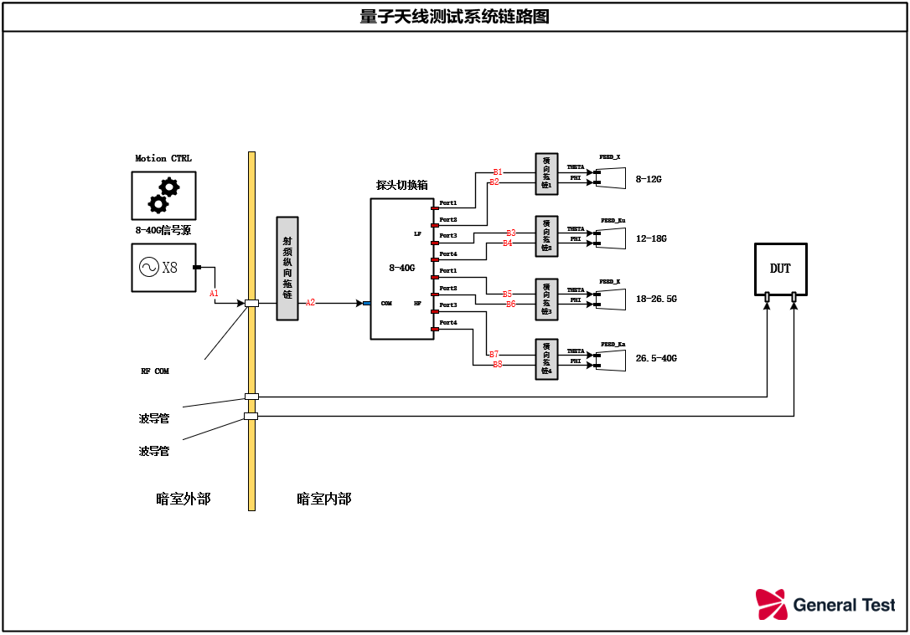

# RNX量子天线测试系统 指令说明

### IEEE488.2
- `*IDN?`
    - ***查询系统IDN信息***
- `*RST`
    - ***复位系统，重置为默认配置***
- `*CLS`
    - ***清空错误队列***
- `*STB?`
    - ***查询status 寄存器状态***
- `*WAI`
    - ***同步指令，等待指令队列执行完毕***
- `*OPC?`
    - ***同步指令，查询当前指令是否完成***

## 系统控制指令

|指令|参数|说明|
|--|--|--|
|`CONFigure:LINK <mode>`|[参数说明](#可选链路配置)|配置链路模式|
|`SOURce:FREQuency <value>`|[参数说明](#信号源配置)|配置信号源频率|
|`SOURce:POWer <value>`|[参数说明](#信号源配置)|配置信号源功率|
|`SOURce:OUTPut <value>`|[参数说明](#信号源配置)|是否开启RF输出|
|`MOTion:HOME <value>`|[参数说明](#馈源定位配置)|运动模组复位|
|`MOTion:FEED <value>`|[参数说明](#馈源定位配置)|模组馈源达位|
|`MOTion:SPEED <value1>,<value2>`|[参数说明](#馈源定位配置)|配置模组速度|
|`READ:LINK:STATe?`|[返回值](#可选链路配置)|查询链路切换配置|
|`READ:SOURce:FREQuency?`|[返回值](#信号源配置)|查询信号输出配置|
|`READ:SOURce:POWer?`|[返回值](#信号源配置)|查询信号输出配置|
|`READ:SOURce:OUTPut?`|[返回值](#信号源配置)|查询信号输出配置|
|`READ:MOTIon:HOME? <value>`|返回值：NO/OK|查询馈源复位状态|
|`READ:MOTIon:FEED? <value>`|返回值：NO/OK|查询馈源达位状态|
|`READ:MOTIon:SPEED? <value>`|[返回值](#馈源速度配置)|查询馈源达位状态|
|`READ:SYSTEM:STATe?`|[返回值](#系统状态)|查询系统状态|

### 可选链路配置
- `FEED_X_THETA`
  - 开关箱切换至X波段馈源，THETA极化
- `FEED_X_PHI`
  - 开关箱切换至X波段馈源，PHI极化
- `FEED_Ku_THETA`
  - 开关箱切换至Ku波段馈源，THETA极化
- `FEED_Ku_PHI`
  - 开关箱切换至Ku波段馈源，PHI极化
- `FEED_K_THETA`
  - 开关箱切换至K波段馈源，THETA极化
- `FEED_K__PHI`
  - 开关箱切换至K波段馈源，PHI极化
- `FEED_Ka_THETA`
  - 开关箱切换至Ka波段馈源，THETA极化
- `FEED_Ka_PHI`
  - 开关箱切换至Ka波段馈源，PHI极化
- `Example`
  - ***CONFigure:LINK FEED_X_THETA*** ——链路切换到X馈源THETA极化
  - ***READ:LINK:STATE?***            ——查询当前链路状态

### 信号源配置
- `FREQuency value`
  - 频率参数，单位:Hz，KHz，MHz，GHz
- `POWer value`
  - 功率参数，单位:dBm，W
- `OUTPut value`
  - RF输出参数：ON，OFF
- `Example`
  - ***SOURce:FREQuency 2.5GHz***   ——信号源配置为2.5GHz
  - ***SOURce:POWer -10.0DBM***     ——信号源配置为-10dBm
  - ***SOURce:OUTPut OFF***         ——信号源RF输出关闭
  - ***READ:SOURce:FREQuency?***    ——查询信号源频率
  - ***READSOURce:POWer?***         ——查询信号源功率
  - ***READ:SOURce:OUTPut?***       ——查询信号源RF输出状态

### 馈源模组定位配置
- `HOME value`
  - 馈源复位参数：X，Ku，K，Ka，Z，ALL
- `FEED value`
  - 馈源达位参数：X，Ku，K，Ka，Z
- `Example`
  - ***MOTion:HOME ALL***         ——配置所有模组执行复位动作
  - ***MOTion:FEED X***           ——查询X模组执行达位动作
  - ***READ:MOTion:HOME? ALL***   ——查询所有模组复位动作是否完成
  - ***READ:MOTion:FEED? X***     ——查询X模组达位动作是否完成

### 馈源模组速度配置
- `SPEED value`
 - 馈源速度参数：LOW, MID1, MID2, MID3, HIGH
- `Example`
  - ***MOTion:SPEED X,LOW*** ——设置X模组速度挡位
  - ***READ:MOTion:SPEED? X***  ——查询X模组速度挡位
